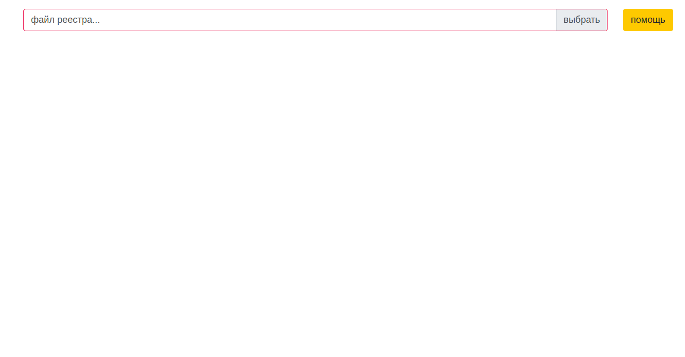

[](https://github.com/sir-go/bank-regs-import/actions/workflows/python-app.yml)

# UTM5 import Sberbank payments (CSV)
A tool for importing Sberbank payment registers into the UTM5 billing system 
and making the cheques  via an ATOL terminal

The backend based on `Flask`, the frontend - `vue.js`. 

## How it works
A cashier gets payment registers (CSV files) from Sberbank, imports them to 
this app, checks the correctness, and tosses the payments to the billing 
system, and creates a task for the TOS terminal to make the fiscal cheques.

## Configure
Edit the `app/conf.py` file before run or pass it to the container

```python
cfg = {
    'billing': {                            # billing access settings
        'api_url': "${BILLING_API_URL}",    # UTM5 api url
        'token': "${BILLING_API_TOKEN}",    # UTM5 api token
        'paymethod_code': 2,                # 'bank transfer'
        'comment': 'по реестрам из банка',  # default comment
        'username': "${BILLING_USERNAME}",  # UTM5 system account name
        'password': "${BILLING_PASSWORD}"   # UTM5 system account password
    },
    'cashbox': {                            # TOS terminal access settings
        'api_url': "${CASHBOX_API_URL}",    # TOS api url
        'token': "${CASHBOX_API_TOKEN}",    # TOS api token
        'default_place': 'касса ТелеТайм',  # default payment place
    },
    'app': {                                # app settings
        'DEBUG': False,                     # run in debug mode ?
        'TESTING': False,                   # is it test run ?
        'SECRET_KEY': "${APP_SECRET}",      # web app secret kay
        'TEMPLATES_AUTO_RELOAD': True       # do reload templates if changed ?
    }
}
```

## Install -> Test -> Run
### Standalone
```bash
virtualenv venv
source ./venv/bin/activate
pip install -r requirements.txt
python -m pytest && python run.py
```
will run the app on http://localhost:8081

### Docker
> prepare a `config.py` config before run

```bash
docker build . -t b-regs
docker run --rm -it -p 80:8081 -v ${PWD}/config.py:/srv/app/config.py:ro b-regs
```
will run the app on http://localhost

### Screecast
> all personal data in the demo isn't real


